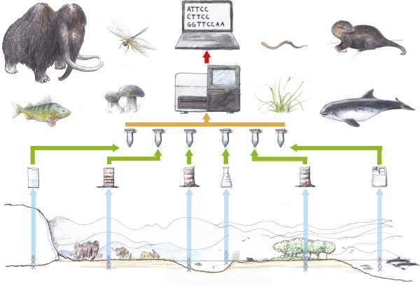
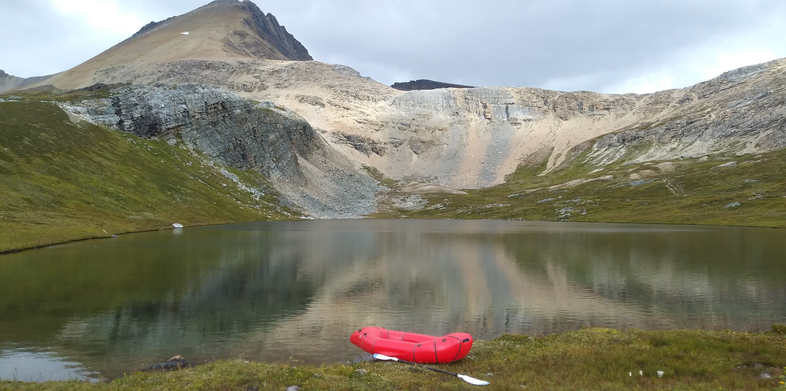

```{r setup, include=FALSE}
knitr::opts_chunk$set(echo = FALSE)
```

### La biosurveillance, du visible à l'invisible

Notre connaissance de la biodiversité a longtemps reposé sur l'observation des espèces dans leur milieu naturel, ou encore sur leur capture. Cela peut vouloir dire de nombreuses heures à attendre que l'une d'entre elles passe sous nos yeux ou s'entremêle dans nos filets. Or, s'extirpant de cet état méditatif et légèrement intrusif, plusieurs scientifiques ont récemment embrassé une tout autre manière de surveiller les espèces. Parmi eux, se trouve la Dre Melania Cristescu, professeure au département de biologie de l'Université McGill et titulaire de la Chaire de recherche en génomique écologique du Canada. Cette dernière scrute l'environnement à la recherche de l'ADN et l'ARN environnemental (ADNe et ARNe).

Si c'est la première fois que vous croisez ces termes, ADNe et ARNe, vous n'êtes pas seuls! Il est assez inhabituel de s'imaginer que ces molécules circulent librement dans l'environnement, mais sachez que tout être vivant laisse derrière lui plusieurs déchets---urine, fèces et peau morte---qui correspondent, entre autres, à des amas de cellules. Ces cellules ont au moins un point commun: elles contiennent des molécules d'ADN et d'ARN.

L'ADN stocke l'information génétique propre à chacun d'entre nous tandis que l'ARN s'occupe de ce qu'on appelle l'expression des gènes, un processus qui mène à l'élaboration des protéines. Autrement dit, l'ADN fournit les plans à l'ARN, qui lui se charge de dicter à la machinerie cellulaire quelles protéines produire pour que nous puissions vaquer à nos occupations.

Ces molécules sont essentielles au bon fonctionnement du vivant. Or, dans les yeux d'un scientifique, leur utilité persiste même lorsqu'elles ne sont plus en mesure de jouer leur rôle respectif. Une fois relâchés dans l'environnement, l'ADNe et l'ARNe peuvent y séjourner un bon moment et comme chaque individu---et chaque espèce---a sa propre signature génétique, il est possible de découvrir en laboratoire qui est passé par là et bien plus...

### Les prouesses de l'ADNe

Cette avancée en science de la biodiversité a suscité un véritable engouement au sein de la communauté scientifique. Pour le Dr Matthew Yates, chercheur postdoctoral au *Great Lake Institute of Environmental Research* (GLIER) affilié à l'Université Windsor en Ontario, « le succès de l'ADNe est assez remarquable. Cela fait seulement une dizaine d'années que le premier article [scientifique] sur [le sujet] a été publié et depuis le domaine a explosé! Il y a eu la création d'un nouveau journal spécifiquement dédié à l'ADNe, les publications augmentent quasi exponentiellement d'une année à l'autre et l'ADNe a rapidement été adopté par plusieurs agences de conservation ... et si c'est le cas, c'est parce que l'ADNe a fait ses preuves! »

L'ADNe comporte des avantages clairs en matière de détection d'espèces. D'une part, en comparaison aux approches typiques de biosurveillance, la détection de l'ADNe est une méthode qui ne nécessite pas d'embêter les espèces. Sur le terrain, il suffit de recueillir quelques échantillons---une petite quantité d'eau, une poignée de terre ou même une pelleté de sédiments---pour ensuite les rapporter au laboratoire, où se fait le gros du travail d'analyse. D'autre part, l'ADNe peut trahir la présence d'espèces auxquelles nous sommes normalement aveugles; il permet de détecter les espèces rares ou encore cryptiques. Ces dernières sont des espèces trompe-l'œil puisqu'elles sont morphologiquement très similaires à d'autres, mais leur génétique est pourtant bien distincte. L'ADNe peut même nous en apprendre sur notre histoire naturelle en révélant au grand jour l'ADN des espèces qui se sont éteintes il y a de cela...des siècles!

::: box
**Comment ça marche?** <br> Un peu comme les aliments au supermarché, l'identification des espèces repose sur les code-barres ADN. Ces code-barres correspondent à des régions d'ADN dont la séquence des nucléotides---unités de base de l'ADN---est spécifique à chaque espèce. Or, à la différence des aliments dont l'attribution des code-barres est plus ou moins aléatoire, l'attribution des code-barres ADN passe par le séquençage de l'ADN de spécimens de référence. Après cela, il est possible de développer des amorces, soit de courtes séquences de nucléotides complémentaires à des régions d'ADN ou d'ARN cibles. Ces amorces---spécifiques à une ou plusieurs espèces---servent à étiqueter l'ADN ou l'ARN qui pourrait se trouver dans les échantillons récoltés sur le terrain.

**Et au laboratoire?**<br> Il s'agit, premièrement, d'isoler et d'étiqueter l'ADN ou l'ARN cible avec une ou plusieurs amorces et, deuxièmement, d'amplifier le signal en produisant des millions de copies des régions ciblées, lesquelles sont normalement en très faible quantité dans l'environnement, au moyen de la réaction en chaîne par polymérase. Au terme de l'analyse, on est en mesure de déterminer la présence ou l'absence d'une espèce cible dans l'échantillon.

Si on cherche plutôt à identifier l'ensemble des espèces qui cohabitent dans un milieu en particulier, on doit ensuite soumettre les millions de copies des régions ciblées au séquençage génétique, lequel révèle la séquence exacte de ce que se trouvait dans l'échantillon. À l'aide de la bio-informatique, il s'ensuit un travail d'association entre les séquences obtenues et les code-barres d'espèces connues.
:::

Ainsi, les applications de l'ADNe en conservation des espèces sont multiples. Toutefois, avec la polyvalence de l'ADNe viennent aussi certaines limites. Si l'ADNe de nos ancêtres les plus lointains peut être conservé durant des siècles, alors comment fait-on pour distinguer l'ADNe issu d'organismes vivants de ceux qui sont morts? Et dans les milieux sans frontières, comme c'est le cas des océans, comment s'assurer que l'ADNe échantillonné provient bien des espèces qui vivent à proximité? C'est ici que l'ARNe entre en jeu. En étant beaucoup moins stable que l'ADNe, l'ARNe a le potentiel de dresser le portrait de la biodiversité au moment et à l'endroit où elle se trouve vraiment.

```{r layout = "l-body-outset"}

```

<center>

Là où l'ADNe des espèces---vivantes ou éteintes---peut être échantillonné. <br><small> Dessin de Lars Holm dans Thomsen et al. 2015 sous license CC

</small>

</center>

### La biodiversité en temps réel

Au départ, plusieurs chercheuses et chercheurs avaient supposé que la dégradation de l'ARNe serait trop rapide pour permettre la détection des espèces à partir de celui-ci. Or, cette supposition a récemment été mise à l'épreuve, et il semblerait que ce ne soit pas tout à fait le cas.

À l'état libre, l'ARNe serait en effet trop instable, mais il ne faut pas s'imaginer que l'ARNe circule sans protection. Ici, la Dre Melania Cristescu explique que tout comme l'ADN « l'ARN n'est pas immédiatement relâché dans l'environnement. Les organismes vont, par exemple, perdre des bouts de tissus... dont des amas de cellules et des cellules vont protéger l'ADN et l'ARN [...] jusqu'à ce qu'elles se dégradent elles-mêmes. » L'ARNe peut ainsi circuler dans l'environnement pendant au moins quelques heures avant d'être lui-même dégradé. Et ces quelques heures sont suffisantes pour que l'ARNe soit prélevé, ramené et analysé en laboratoire!

Dans le domaine, cela a suscité beaucoup d'enthousiasme, car si l'on détecte l'ARNe d'un organisme à un certain endroit, c'est probablement un signe que ce dernier y soit passé récemment. Quand vient le temps de statuer sur l'état d'une espèce en danger, ou encore sur la présence d'une espèce dite invasive, c'est à dire qui peut menacer la biodiversité locale, on constate que cette résolution temporelle et spatiale est très importante. Comme l'explique la Dre Cristescu « lorsqu'une molécule [comme l'ADN] persiste autant longtemps dans l'environnement, c'est-à-dire des mois, des années, jusqu'à se fossiliser, le signal [d'une espèce] voyage beaucoup ». L'ADNe peut donc voyager avec vents et marées et se retrouver à des endroits jamais fréquentés par les espèces elles-mêmes. À cela, le Dr Yates souline un autre problème avec lequel les études basées sur l'ADNe doivent composer: « l'ADNe des organismes morts peut également continuer d'être relâché massivement dans l'environnement [lors du processus de décomposition]. »

Ainsi, si l'instabilité de l'ARN apparaissait comme une limite à la détection d'espèces, cela est vite devenu un avantage! Lorsqu'on s'intéresse aux espèces locales et surtout aux espèces vivantes, on veut s'assurer que le signal d'une espèce a *récemment* été émis dans l'environnement. Sans cela, on pourrait s'imaginer qu'une espèce occupe toujours un milieu, alors que ce n'est plus le cas, et vice versa.

### Détecter les espèces...oui, mais encore?

Le potentiel de l'ARNe ne s'arrête pas là.

Au-delà de la simple détection d'espèces, l'ARNe peut nous révéler davantage d'informations sur la biodiversité. Quel est le portrait des individus? Sont-ils jeunes ou plutôt âgés? Sont-ils en bonne santé ou bien stressés? Les réponses à ces questions ne sont pas étrangères à l'ARNe.

Si c'est le cas, c'est parce qu'au contraire de l'ADN---identique dans chaque cellule d'un même individu---l'ARN d'un individu diffère d'une cellule à une autre, mais également d'un moment à un autre. En effet, le profil de l'ARN change en fonction du type cellulaire, par exemple les cellules épidermiques, les cellules musculaires ou les cellules sanguines, du stade de développement des individus et des stress environnementaux.

À titre d'exemple, le Dr Yates mentionne que « le réchauffement de l'eau », une source de stress auquel de nombreux animaux sont désormais confrontés, « peut favoriser l'expression des gènes responsables de la production des protéines de choc thermique ». Ces protéines, qui permettent aux animaux de s'acclimater aux changements de température, peuvent être utilisées comme des marqueurs de stress. Ainsi, avec la bonne amorce sous la main, il pourrait être possible de cibler et quantifier l'ARNe responsable de la production de ces protéines et donc, de monitorer la santé des espèces dans leur habitat!

À ce propos, Julien Beaulieu, candidat au doctorat en biologie à l'Université du Québec à Montréal (UQAM) codirigé par la Dre Cristescu, est l'un des premiers chercheurs à tester le potentiel de l'ARNe en milieu naturel. Dans ses recherches, il tente de quantifier le stress thermique de la truite mouchetée, une espèce de poissons introduite il y a plus d'une cinquantaine d'années, et désormais invasive, en Colombie-Britannique. Le recours à ce genre de marqueurs afin d'étudier l'état de santé des animaux n'est pas nouveau, mais comme l'explique Julien Beaulieu, cette approche « a le potentiel de réduire l'effort d'échantillonnage, [c'est-à-dire le temps passé sur le terrain] et de ne pas avoir à tuer une partie des poissons pour savoir si [les poissons restants] sont en santé! »

```{r fig.align='center'}

```

<center>

Le *Helen Lake* en Colombie-Britannique: <br>l'un des lacs où Julien Beaulieu mène ses travaux de recherche <br><small>Crédit photo: Alison Derry, professeure à l'UQAM et codirectrice de Julien Beaulieu</small>

</center>

À plus large échelle, la Dre Cristescu démontre une certaine excitation devant le fait que grâce à l'ARNe, il serait possible de cibler l'ARN de plusieurs espèces simultanément, et ce, à partir des mêmes échantillons d'eau. Il serait même possible de déterminer l'état de santé d'une communauté entière!

Cependant, il est encore un peu trop tôt pour utiliser cette méthode en milieu naturel, car le niveau de complexité monte de plusieurs crans : les stress sont multiples, les espèces peuvent être abondantes et les bases de données de code-barres sont encore incomplètes. La Dre Cristescu souligne néanmoins que « certaines expériences nous permettent d'imiter les milieux naturels et d'avoir une bonne idée de ce qui pourrait s'y passer ».

Par exemple, à la station écologique de McGill, des mésocosmes, soit de gros bassins remplis d'eau de lac, sont utilisés pour comprendre la réponse des communautés naturellement assemblées---et somme toute assez complexes---face à différents stress. Les scientifiques peuvent donc tester le potentiel de l'ARNe en contrôlant la quantité et l'intensité des stress auxquels les communautés sont soumises.

Ainsi, l'ARNe aurait le potentiel de reconstituer le portrait et l'état de santé des individus, des espèces, voire des communautés! Or, tel que l'indique le Dr Yates, « on est encore à l'étape de la preuve par le concept ». L'étendue des possibilités de l'ARNe, de même que la faisabilité de ce genre d'étude en milieu naturel, reste encore à valider.

### Des idées à la recherche

Ensemble, l'ADNe et l'ARNe nous permettent de surveiller de près la biodiversité.

Alors que l'ADNe a déjà fait ses preuves en matière de détection d'espèces, l'ARNe viendrait combler les angles morts inhérents à l'ADNe, en plus de nous livrer de précieuses informations sur le portrait et la santé des espèces.

La recherche sur l'ARNe est encore à ses débuts, mais face aux menaces qui pèsent sur la biodiversité, des scientifiques motivés se retroussent les manches.

La prochaine étape? « Optimiser et valider les protocoles d'extraction d'ARNe dans les milieux naturels », déclare le Dr Yates. Il va falloir répondre à des questions bien précises, à commencer par « jusqu'à quel point peut-on détecter de manière fiable l'ARNe dans les milieux naturels? », poursuit ce dernier.

Une chose est certaine, en regardant l'histoire accélérée de l'ADNe, on comprend que la recherche dans le domaine est foisonnante! Inspirée, la Dre Cristescu pense que l'ARNe se taillera une place de choix dans le monde de la biosurveillance.

D'ici là, restons à l'affût!

------------------------------------------------------------------------

**Vanessa Di Maurizio**

14 374 caractères
